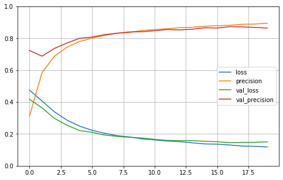

### Plant Pathology Challenge 2021

This competition is part of the *Fine-Grained Visual Categorization(FGVC8)* workshop at the Computer Vision and Pattern Recognition Conference- **CVPR 2021**. 
In this repository, I have provided a solution for the challenge. It was multi-label classification problem. I used pre-trained InceptionV3 as the main feature extractor. The highest achieved validation accuracy was 87.34%.

